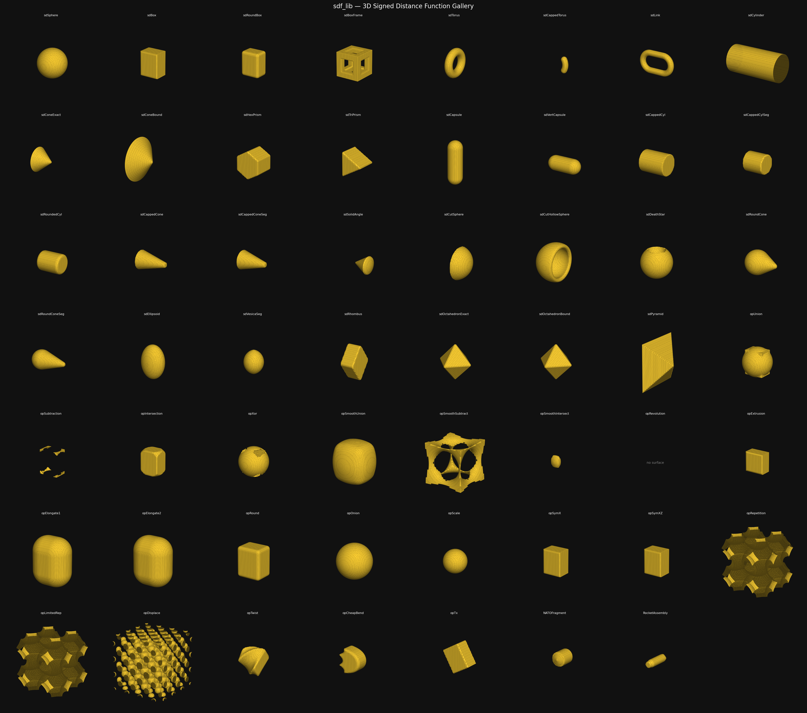

# pySdf — Signed Distance Functions in Python

A library of signed distance functions (SDFs) for 2D and 3D geometry, implemented in pure NumPy.
SDF formulas are adapted from [iquilezles.org](https://iquilezles.org/articles/distfunctions/).
Optional [pyAMReX](https://pyamrex.readthedocs.io/en/latest/) integration provides `MultiFab` output for parallel solvers.

## Installation

### Core library (NumPy only)

```bash
uv sync
```

### With visualization extras (matplotlib, plotly, scikit-image)

```bash
uv sync --extra viz
```

### Development (adds pytest)

```bash
uv sync --extra dev
```

### With pyAMReX (optional — for MultiFab/parallel grid output)

**pyAMReX is not on PyPI.** Choose one of the methods below.

#### Option A — conda (CPU only, easiest)

```bash
conda create -n pyamrex -c conda-forge pyamrex
conda activate pyamrex
uv sync
```

#### Option B — build from source (GPU / MPI / custom dimensions)

```bash
git clone https://github.com/AMReX-Codes/pyamrex.git $HOME/src/pyamrex
cd $HOME/src/pyamrex
cmake -S . -B build -DAMReX_SPACEDIM="1;2;3"
cmake --build build -j 4 --target pip_install
```

> **Dimension constraint:** Only one space dimension can be imported per Python
> process (`amrex.space2d` *or* `amrex.space3d`, not both simultaneously).

See the full guides:
[conda install](https://pyamrex.readthedocs.io/en/latest/install/users.html) ·
[cmake build](https://pyamrex.readthedocs.io/en/latest/install/cmake.html)

## Documentation

- **[API_DOCUMENTATION.md](API_DOCUMENTATION.md)**: Complete API reference for all packages
- **[LIBRARY_STRUCTURE.md](LIBRARY_STRUCTURE.md)**: Folder structure and design overview
- **[INSTALLATION.md](INSTALLATION.md)**: Detailed installation and troubleshooting
- **[examples/](examples/)**: Standalone runnable examples

## Package overview

| Package | Purpose |
|---------|---------|
| `sdf2d` | 2D geometry classes, grid sampling, optional AMReX output |
| `sdf3d` | 3D geometry classes, grid sampling, optional AMReX output |
| `stl2sdf` | Convert STL mesh → SDF grid (pure NumPy, watertight meshes) |

## Files

- `_sdf_common.py` — Shared math helpers (`vec2`/`vec3`, `opUnion`, `opSubtraction`, …)
- `sdf2d/` — 2D package: `Circle2D`, `Box2D`, `Hexagon2D`, … (~50 shapes)
- `sdf3d/` — 3D package: `Sphere3D`, `Box3D`, `Torus3D`, … (~30 shapes + warps)
- `sdf3d/examples/` — High-level assemblies (`NATOFragment`, `RocketAssembly`)
- `stl2sdf/` — STL mesh → SDF: `load_stl`, `mesh_to_sdf`, `sample_sdf_from_stl`
- `tests/` — pytest suite (308 pass, 1 skip for AMReX); no AMReX required
- `scripts/` — Gallery scripts and AMReX plotfile renderer
- `examples/` — Standalone demos; outputs written to `examples/`
- `gallery_2d.png`, `gallery_3d.png` — Pre-rendered shape galleries

## Running tests

```bash
uv run pytest tests/ -v
```

308 tests pass without AMReX. `tests/test_amrex.py` skips automatically via `pytest.importorskip`.

## Gallery scripts

```bash
# All ~50 sdf2d shapes (requires matplotlib)
uv run python scripts/gallery_2d.py --out gallery_2d.png

# All sdf3d primitives (requires matplotlib + scikit-image)
uv run python scripts/gallery_3d.py --out gallery_3d.png --res 64
uv run python scripts/gallery_3d.py --res 48  # faster draft
```

### 2D shape gallery (`sdf2d`)


_Blue = inside (φ < 0), red = outside (φ > 0), white contour = surface (φ = 0)._

### 3D shape gallery (`sdf3d`)



_Gold isosurfaces extracted from 3D SDF grids using marching cubes._

## Library usage

### `sdf2d` — 2D geometry

```python
from sdf2d import Circle2D, Box2D, Union2D, sample_levelset_2d

circle = Circle2D(radius=0.3)
box    = Box2D(half_size=(0.4, 0.2)).translate(0.5, 0.0)
shape  = circle.union(box)

phi = sample_levelset_2d(shape, bounds=((-1,1), (-1,1)), resolution=(128, 128))
# phi.shape == (128, 128);  phi < 0 inside, phi > 0 outside
```

### `sdf3d` — 3D geometry

```python
from sdf3d import Sphere3D, Box3D, Union3D, sample_levelset_3d

sphere = Sphere3D(radius=0.3)
box    = Box3D(half_size=(0.2, 0.2, 0.2)).translate(0.4, 0.0, 0.0)
shape  = Union3D(sphere, box)

phi = sample_levelset_3d(shape, bounds=((-1,1),(-1,1),(-1,1)), resolution=(64,64,64))
# phi.shape == (64, 64, 64);  phi < 0 inside, phi > 0 outside
```

### `stl2sdf` — STL mesh to SDF

```python
from stl2sdf import sample_sdf_from_stl

phi = sample_sdf_from_stl(
    "my_mesh.stl",
    bounds=((x0,x1), (y0,y1), (z0,z1)),
    resolution=(64, 64, 64),
)
# phi.shape == (64, 64, 64);  requires watertight mesh
```

See `examples/stl_sdf_demo.py` for a full demo that downloads the ISS ratchet wrench
STL (the first object 3D-printed in space, Dec 2014) and renders an interactive Plotly
figure.

```bash
uv run python examples/stl_sdf_demo.py --res 20   # quick draft
uv run python examples/stl_sdf_demo.py --res 40   # full quality
```

### AMReX output (optional)

```python
import amrex.space3d as amr
from sdf3d import SDFLibrary3D

amr.initialize([])
try:
    real_box = amr.RealBox([-1,-1,-1], [1,1,1])
    domain   = amr.Box(amr.IntVect(0,0,0), amr.IntVect(63,63,63))
    geom     = amr.Geometry(domain, real_box, 0, [0,0,0])
    ba       = amr.BoxArray(domain); ba.max_size(32)
    dm       = amr.DistributionMapping(ba)

    lib = SDFLibrary3D(geom, ba, dm)
    mf  = lib.sphere(center=(0,0,0), radius=0.3)
    # mf is an amr.MultiFab
finally:
    amr.finalize()
```

## How the two evaluation paths compare

| Path | Requires | Returns | Use case |
|------|----------|---------|----------|
| **NumPy** | `numpy` only | `np.ndarray` | design, testing, visualization |
| **AMReX** | pyAMReX via conda | `amr.MultiFab` | parallel solver input |

Both paths use identical SDF math from `primitives.py`.

## SDF sign convention

| Value | Meaning |
|-------|---------|
| φ < 0 | inside the solid |
| φ = 0 | on the surface |
| φ > 0 | outside the solid |
